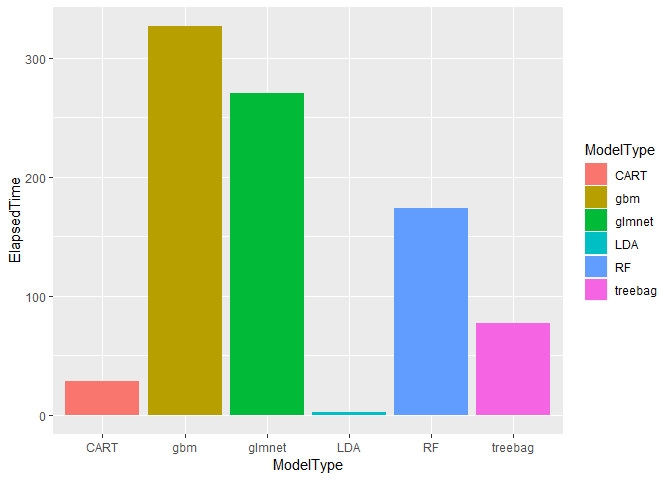
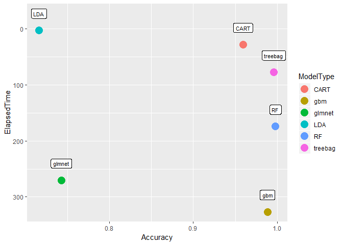

# Background

* Using devices such as Jawbone Up, Nike FuelBand, and Fitbit it is now possible to collect a large amount of data about personal activity relatively inexpensively. These type of devices are part of the quantified self movement – a group of enthusiasts who take measurements about themselves regularly to improve their health, to find patterns in their behavior, or because they are tech geeks. One thing that people regularly do is quantify how much of a particular activity they do, but they rarely quantify how well they do it. In this project, your goal will be to use data from accelerometers on the belt, forearm, arm, and dumbell of 6 participants. They were asked to perform barbell lifts correctly and incorrectly in 5 different ways. More information is available from the website here: http://web.archive.org/web/20161224072740/http:/groupware.les.inf.puc-rio.br/har (see the section on the Weight Lifting Exercise Dataset).  

# Data  
 
* The training data for this project are available here:  
  
* https://d396qusza40orc.cloudfront.net/predmachlearn/pml-training.csv  
  
* The test data are available here:  
  
* https://d396qusza40orc.cloudfront.net/predmachlearn/pml-testing.csv\  

* The data for this project come from this source: http://web.archive.org/web/20161224072740/http:/groupware.les.inf.puc-rio.br/har. If you use the document you create for this class for any purpose please cite them as they have been very generous in allowing their data to be used for this kind of assignment.

# Loading necessary packages

```r
library(caret)
```

```
## Loading required package: lattice
```

```
## Loading required package: ggplot2
```

```r
library(glmnet)
```

```
## Warning: package 'glmnet' was built under R version 3.5.2
```

```
## Loading required package: Matrix
```

```
## Loading required package: foreach
```

```
## Loaded glmnet 2.0-16
```

# Getting and Cleaning Data

```r
#Getting data
download.file("https://d396qusza40orc.cloudfront.net/predmachlearn/pml-training.csv", destfile = "./training.csv")
download.file("https://d396qusza40orc.cloudfront.net/predmachlearn/pml-testing.csv", destfile = "./testing.csv")
testingData<-read.csv("./testing.csv")
trainingData<-read.csv("./training.csv")

#setting seed
set.seed(2019)

#Cleaning Data
#Remove NA & empty entry features
RemoveNACol<-which(sapply(trainingData,function(x){sum(is.na(x))>19000}))
RemoveEmptyCol<-which(sapply(trainingData,function(x){sum(x=="")>19000}))

#Remove near zero variance features which will not have a great impact on prediction
nsv<-nearZeroVar(trainingData[,-160],saveMetrics = TRUE)
nzvRemove<-which(nsv$zeroVar==T | nsv$nzv==T)

#Removing names,labels and non-activity features
nonactivityRemove<-1:5

RemoveCol<- unique(c(RemoveEmptyCol,RemoveNACol, nzvRemove, nonactivityRemove))

#Data after being cleaned and having only useful data for prediction
testingData<- testingData[,-RemoveCol]
trainingData <- trainingData [,-RemoveCol]
```

# Prediction study design:  
Check course slide 7/8 in Prediction study design for reference:

* 60% training

* 20% testing

* 20% validation (keeping to the last to train one time only)

```r
inTrain<-createDataPartition(trainingData$classe,p=0.8,list = FALSE)
# validation size = 20% , training+testing = 80%
training<-trainingData[inTrain,]
validation<-trainingData[-inTrain,]
# By choosing cross validation method and k-fold = 4 in (MyControl) so
# training = (3/4 * 80%) = 60% 
# testing = (1/4 * 80%) = 20%
MyControl <- trainControl(method = "cv", number = 4, verboseIter = TRUE)
```

# Training prediction Models
* With system.time function we both process model training argument inside it and also get time (elapsed time) in one shot. 
We have the following models:
1. glmnet: Lasso and Elastic-Net Regularized Generalized Linear Models --> method="glmnet"
2. CART : Classification and regression tree --> method="rpart"
3. treebag (Bagging)  --> method="treebag"
4. RF (Random Forest) --> method="RF"
5. Boostgbm (Boosting) : Generalized Boosted Regression Models --> method = "gbm"
6. LDA : Linear discriminant analysis --> method="lda""

```r
ElapsedTimeGLMNET<-system.time(modelGLMNET<-train(classe~.,data = training,method="glmnet",trControl=MyControl,tuneGrid = expand.grid(
alpha = 0.5,lambda = 0.0003)))[3]
ElapsedTimeCART<-system.time(modelCART<-train(classe~.,data=training,method="rpart",tuneLength=100,trControl=MyControl))[3]
ElapsedTimetreebag<-system.time(modeltreebag<-train(classe~.,data=training,method="treebag",trControl=MyControl))[3]
ElapsedTimeRF<-system.time(modelRF<-train(classe~.,data=training,method="ranger",tuneLength=3,trControl=MyControl))[3]
ElapsedTimeBoostgbm<-system.time(modelBoostgbm<-train(classe~.,data=training,method="gbm",tuneLength=3,trControl=MyControl))[3]
ElapsedTimeLDA<-system.time(modelLDA<-train(classe~.,data=training,method="lda",trControl=MyControl))[3]
```

# Finding Accuracy of models from cross validation 

```r
#Cross validation accuracy (using each model)
ModelType<-c("glmnet","CART","treebag","RF","gbm","LDA")
AccuracyCV<-c(max(modelGLMNET$results$Accuracy),max(modelCART$results$Accuracy),max(modeltreebag$results$Accuracy),max(modelRF$results$Accuracy),max(modelBoostgbm$results$Accuracy),max(modelLDA$results$Accuracy))
AccuracyCVTable<-data.frame(ModelType,AccuracyCV)
#Each model cross validation accuracy
AccuracyCVTable
```

```
##   ModelType AccuracyCV
## 1    glmnet  0.7385827
## 2      CART  0.9558562
## 3   treebag  0.9940761
## 4        RF  0.9975160
## 5       gbm  0.9869425
## 6       LDA  0.7129122
```

# Predicting on validation portion of data & finding models accuracy (100% - out of sample error)
1. Predicting validation set (using each model)
2. Getting accuracy of each model by comparing (classe) prediction to real values in validation$calsse using Confusion matrix.
3. Comparing Accuracy we got in cross validation (AccuracyCV) while training the models with K-Folds, with Accuracy we get on validation set (Accuracy), We expect them to be almost the same.
4. Creating comparison table between models to Evaluate the models we used.

```r
#Predicting validation set (using each model)
predGLMNET<-predict(modelGLMNET, validation)
predCART<-predict(modelCART, validation)
predtreebag<-predict(modeltreebag, validation)
predRF<-predict(modelRF, validation)
predBoostgbm<-predict(modelBoostgbm, validation)
predLDA<-predict(modelLDA, validation)

#Getting accuracy of each model by comparing (classe) prediction to real values in validation$calsse using Confusion matrix.
Accuracy<-c(confusionMatrix(predGLMNET, validation$classe)$overall[1],
            confusionMatrix(predCART, validation$classe)$overall[1],
            confusionMatrix(predtreebag, validation$classe)$overall[1],
            confusionMatrix(predRF, validation$classe)$overall[1],
            confusionMatrix(predBoostgbm, validation$classe)$overall[1],
            confusionMatrix(predLDA, validation$classe)$overall[1])

#Comparing cross validation accuracy with accuracy results in validation set prediction (we predict them to be almost equal)
AccuracyCompare<-data.frame(AccuracyCVTable,Accuracy)
AccuracyCompare
```

```
##   ModelType AccuracyCV  Accuracy
## 1    glmnet  0.7385827 0.7425440
## 2      CART  0.9558562 0.9592149
## 3   treebag  0.9940761 0.9959215
## 4        RF  0.9975160 0.9979607
## 5       gbm  0.9869425 0.9882743
## 6       LDA  0.7129122 0.7160336
```

```r
#Creating comparison table between models
ElapsedTime<-c(ElapsedTimeGLMNET, ElapsedTimeCART, ElapsedTimetreebag, ElapsedTimeRF, ElapsedTimeBoostgbm, ElapsedTimeLDA)
ModelsTable<-data.frame(ModelType,Accuracy,ElapsedTime)
ModelsTable
```

```
##   ModelType  Accuracy ElapsedTime
## 1    glmnet 0.7425440      270.15
## 2      CART 0.9592149       27.94
## 3   treebag 0.9959215       77.22
## 4        RF 0.9979607      174.05
## 5       gbm 0.9882743      326.50
## 6       LDA 0.7160336        2.44
```

```r
gtime<-ggplot(data = ModelsTable, aes(x=ModelType,y=ElapsedTime))
gaccuracy<-ggplot(data = ModelsTable, aes(x=ModelType,y=Accuracy))
gboth<-ggplot(data = ModelsTable, aes(x=Accuracy,y=ElapsedTime))

gtime+geom_col(aes(fill=ModelType))
```

<!-- -->

```r
#In terms of time elapsed CART was the best among accurate models (we neglect LDA as it had bad accuracy)
gaccuracy+geom_col(aes(fill=ModelType))
```

<!-- -->

```r
#In terms of Accuracy RF was the best, then treebag, CART and gbm are slightly less accurate.
gboth+geom_point(size=5,aes(col=ModelType))+geom_label(label=ModelType,size=3,nudge_y=30)+scale_y_reverse()
```

<!-- -->

```r
#In terms of both RF & treebag were a good trade accuracy/time elapsed tradeoff
```

# Predicting quiz 20 observations
We will apply all our models then take a vote about each observations 

```r
#To be able to run predection on Quiz test set the name of outcome should be the same as it is training set and prediction models
problem_id<- testingData$problem_id
colnames(testingData)[colnames(testingData) == "problem_id"] <- "classe"
#Predicting Classe in Quiz test set using our models
GLMNET20<-predict(modelGLMNET, testingData)
CART20<-predict(modelCART, testingData)
treebag20<-predict(modeltreebag, testingData)
RF20<-predict(modelRF, testingData)
gbm20<-predict(modelBoostgbm, testingData)
LDA20<-predict(modelLDA, testingData)
#Gathering results in one table
predtestingDataTotal<-data.frame(problem_id, GLMNET20, CART20, treebag20, RF20, gbm20, LDA20)
#Taking vote from all models 
predtestingDataTotal$FinalVote<-apply(predtestingDataTotal,1,function(x) names(which.max(table(x))))
QuizAnswer<-data.frame(problem_id=1:20,FinalModelVote=apply(predtestingDataTotal,1,function(x) names(which.max(table(x)))))
#Printing predtestingDataTotal
predtestingDataTotal
```

```
##    problem_id GLMNET20 CART20 treebag20 RF20 gbm20 LDA20 FinalVote
## 1           1        C      B         B    B     B     B         B
## 2           2        A      A         A    A     A     A         A
## 3           3        B      B         B    B     B     B         B
## 4           4        A      A         A    A     A     A         A
## 5           5        A      A         A    A     A     A         A
## 6           6        E      E         E    E     E     E         E
## 7           7        D      D         D    D     D     D         D
## 8           8        D      A         B    B     B     D         B
## 9           9        A      A         A    A     A     A         A
## 10         10        A      A         A    A     A     A         A
## 11         11        C      C         B    B     B     D         B
## 12         12        A      C         C    C     C     A         C
## 13         13        B      B         B    B     B     B         B
## 14         14        A      A         A    A     A     A         A
## 15         15        E      E         E    E     E     B         E
## 16         16        E      E         E    E     E     A         E
## 17         17        A      A         A    A     A     A         A
## 18         18        B      B         B    B     B     B         B
## 19         19        B      B         B    B     B     B         B
## 20         20        B      B         B    B     B     B         B
```

```r
#Printing Quiz Answer
QuizAnswer
```

```
##    problem_id FinalModelVote
## 1           1              B
## 2           2              A
## 3           3              B
## 4           4              A
## 5           5              A
## 6           6              E
## 7           7              D
## 8           8              B
## 9           9              A
## 10         10              A
## 11         11              B
## 12         12              C
## 13         13              B
## 14         14              A
## 15         15              E
## 16         16              E
## 17         17              A
## 18         18              B
## 19         19              B
## 20         20              B
```
